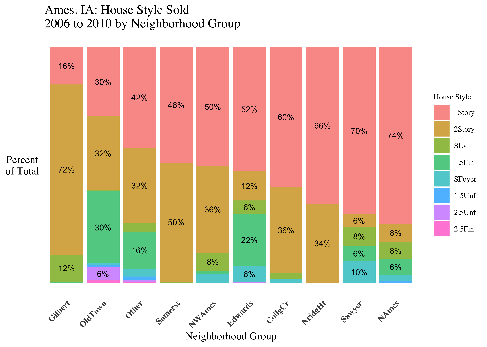
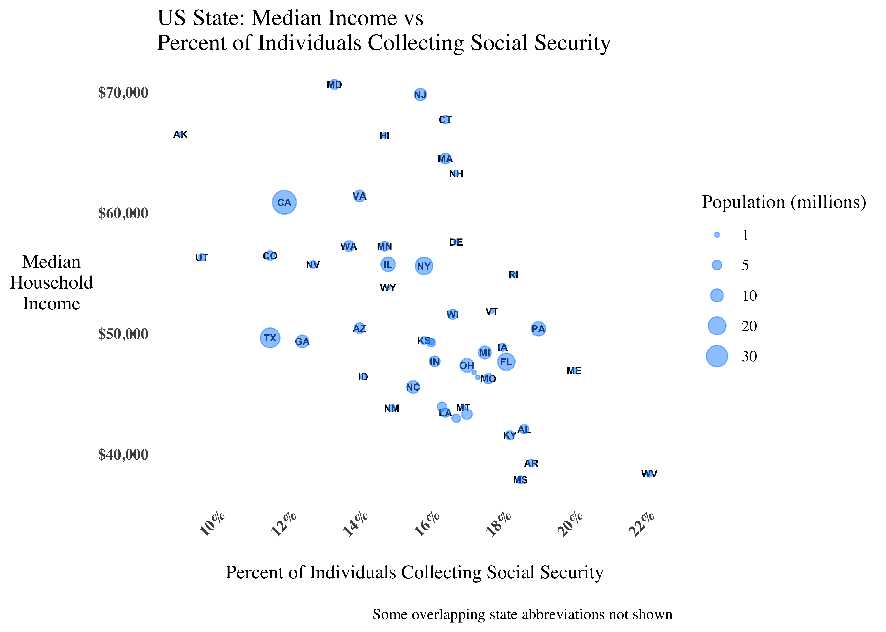

R Data Visualization Gallery
================

### Notebook Purpose

  - R code patterns for common data visualization use cases

<!-- end list -->

``` r
required_packages <- c('tidyverse', 'janitor', 'ggthemes',
                       'openintro', 'ggrepel', 'ggpubr', 'scales',
                       'directlabels', 'fpp3', "tidytext", "tsdl")

for(p in required_packages){
  ### uncomment to install packages not on your machine
  # if(!require(p,character.only = TRUE))
  #     install.packages(p, repos = "http://cran.us.r-project.org")
  library(p,character.only = TRUE)
}

base_plot_theme <- function() {
  theme_tufte() +
  theme(axis.text.x = element_text(angle = 45, hjust = 1, vjust = 1),
        axis.text = element_text(face="bold"),
        axis.title.y = element_text(angle = 0, vjust = 0.5),
        axis.ticks = element_blank())
  }
```

### Bar Chart

``` r
mpg %>%
  tabyl(manufacturer) %>%
  ggplot(aes(x=reorder(manufacturer, -percent),
             y=percent)) +
  geom_col(fill="dodgerblue", alpha=0.8) +
  geom_text(aes(label=paste0("n=",n)), vjust=-0.5, size=4) +
  base_plot_theme() +
  scale_y_continuous(labels = scales::percent_format(accuracy=1),
                     breaks = seq(0,1,.02),
                     expand = expansion(mult = c(0, .1))) +
  labs(title="Distribution of Cars of by Manufacturer",
       y="Percent of\nTotal",
       x="Manufacturer")
```


### Stacked Bar Chart

``` r
ames_stacked <- ames %>%
  clean_names() %>%
  mutate(neighborhood_grouped = fct_lump_n(neighborhood,n=9)) %>%
  group_by(neighborhood_grouped, house_style) %>%
  count() %>%
  group_by(neighborhood_grouped) %>%
  mutate(pct_total_neighborhood = n/sum(n)) %>%
  ungroup()
  
### orders the plot sequence of how the neighborhoods and house style appear
ames_stacked <- ames_stacked %>%
  group_by(neighborhood_grouped) %>%
  mutate(one_story_nh_pct_total = max(
    ifelse(house_style=="1Story",pct_total_neighborhood,NA),
    na.rm = T
   )
  ) %>%
  ungroup() %>%
  mutate(neighborhood_grouped = fct_reorder(
    neighborhood_grouped, 
    one_story_nh_pct_total 
   )
  ) %>%
  ungroup() %>%
  mutate(house_style_2 = fct_reorder2(
    house_style, 
    neighborhood_grouped, 
    pct_total_neighborhood
   )
  )

ames_stacked %>%
  ### only label if stack pct total greater than 4%
  mutate(stack_label = case_when(
    pct_total_neighborhood > .04 ~ scales::percent(pct_total_neighborhood,2)
  )) %>%
  ggplot(aes(x=neighborhood_grouped,
             y=pct_total_neighborhood,
             fill=house_style_2)) +
  geom_col(position = "stack", alpha=0.75) +
  geom_text(aes(label = stack_label),
            ### note pattern here to get labels to center on bar stack
            position = position_stack(vjust = 0.5),
            size=3) +
  base_plot_theme() +
  theme(legend.title = element_text(size = 8), 
        legend.text = element_text(size = 8),
        axis.text.y = element_blank()) +
  labs(title="Ames, IA: House Style Sold\n2006 to 2010 by Neighborhood Group",
    x="Neighborhood Group",
    y="Percent\nof Total",
    fill="House Style")
```



### Histogram

``` r
# using ggpubr for fast out of the box presentation ready charts
ChickWeight %>% filter(Diet==1 | Diet==3) %>%
  ggpubr::gghistogram(
    x="weight", color="Diet", fill="Diet",
    add = "mean", bins=15
  ) +
  scale_x_continuous(breaks=seq(0,500,50)) +
  base_plot_theme() +
  theme(legend.title = element_text(size = 8), 
        legend.text = element_text(size = 8),
        legend.position = "top") +
  labs(title="Distribution of Chicken Weight for Two Experimental Diets",
     subtitle = "Vertical dashed line: average group weight",
     x="Chick Weight",
     y="Chick\nCount")
```


### Density Plot

``` r
diamonds %>%
  filter(cut %in% c("Fair", "Ideal"),
         carat <= 3) %>%
  ggpubr::ggdensity(
    x="carat", color = "cut", fill = "cut", add = "mean",
    palette = c("dodgerblue", "grey40")
  ) +
  scale_x_continuous(breaks=seq(0,3,0.25)) +
  base_plot_theme() +
  theme(legend.title = element_text(size = 8), 
        legend.text = element_text(size = 8),
        axis.text.x = element_text(size = 10),
        legend.position = "top") +
  labs(title="Distribution of Carat Weight: Fair vs Ideal Cut Diamonds",
     subtitle = "Vertical dashed line: average carat weight",
     fill="Cut",
     color="Cut",
     x="Carat Weight",
     y="Carat\nDensity")
```


### Scatter Plot

``` r
states_scatter <- us_rent_income %>%
  select(NAME, variable, estimate) %>%
  pivot_wider(names_from=variable, values_from=estimate) %>%
  mutate(state_abb = usdata::state2abbr(NAME)) %>%
  filter(NAME!="Puerto Rico") ### drop PR | no income data

states_scatter %>%
  ggplot(aes(x=rent, y=income)) + 
  geom_smooth(method="lm") +
  stat_cor(p.accuracy = 0.001, r.accuracy = 0.01, cor.coef.name="r") +
  geom_text_repel(aes(label=state_abb), 
                  box.padding=0.01,
                  size=2.5) +
  scale_x_continuous(labels=dollar_format()) +
  scale_y_continuous(labels=dollar_format()) +
  base_plot_theme() +
  labs(title = "US State\nMedian Yearly Income vs Median Monthly Rent",
       x="Median Monthly Rent",
       y="Median \nYearly \nIncome ",
       caption = "r = pearson correlation coefficient")
```


### Bubble Plot

``` r
state_to_region <- tibble(
  state_abb = state.abb,
  state_region = state.region
)

state_stats %>% 
  inner_join(state_to_region, by = c("abbr" = "state_abb")) %>%
  mutate(pop2010_mil = pop2010/10^6,
         soc_sec_2 = soc_sec/100) %>%
  ggplot(aes(y=med_income, x=soc_sec_2)) +
  geom_text(aes(label=abbr), check_overlap=T, size=2,
            fontface="bold") +
  geom_point(aes(size=pop2010_mil), alpha=0.5, color="dodgerblue") +
  scale_y_continuous(labels = dollar_format()) +
  scale_x_continuous(labels = scales::percent_format(accuracy=1),
                   breaks = seq(0,1,.02)) +
  scale_size_area("Population (millions)", breaks=c(1, 5, 10, 20, 30)) +
  base_plot_theme() +
  labs(title = "US State: Median Income vs 
Percent of Individuals Collecting Social Security",
       x="\nPercent of Individuals Collecting Social Security",
       y="Median\nHousehold\nIncome",
       caption = "\nSome overlapping state abbreviations not shown")
```


### Boxplot

``` r
state_stats %>%
  inner_join(state_to_region, by = c("abbr" = "state_abb")) %>%
  mutate(state_region_2 = fct_reorder(state_region, med_income, median)) %>%
  ggplot(aes(x=state_region_2,
             y=med_income,
             color=state_region_2)) +
  geom_boxplot(alpha = 0.85) +
  geom_text_repel(aes(label = abbr),
    direction = "y",
    nudge_x = .15,
    box.padding = 0.02,
    size = 2,
    segment.alpha = 0.35,
    min.segment.length = 0) +
  scale_y_continuous(labels = dollar_format(),
                     breaks=seq(0,80000,5000)) +
  base_plot_theme() +
  theme(legend.position = "none",
    axis.text.x = element_text(angle = 0, hjust = 0.5, vjust = 1)) +
  labs(title = "US Median Household Income by State and State Region",
       x = "\nUS State Region",
       y = "Median\nHousehold\nIncome")
```



### Time Series Trend Line Plots

``` r
pigs_ts <- tsibbledata::aus_livestock %>%
   filter(Animal=="Pigs",
          Month>=yearmonth('1990-01-01'),
          Month<=yearmonth('1995-12-01'),
          State=="Victoria")

pigs_ts %>%
  feasts::gg_season(Count, labels="both", size=2, alpha=0.5) +
  base_plot_theme() +
  scale_y_continuous(label=comma) + 
  scale_x_yearmonth(expand = expansion(mult=c(.075,.075)),
                    date_breaks = "1 month",
                    date_label = "%b") +
  labs(title="Number of Pigs Slaughter by Year",
       subtitle = "Victoria, Australia",
       x="Calendar Month",
       y="Pig  \nCount  ")
```


### Multi-panel Trend Line Plots for Comparison

``` r
gafa_stock_2 <- gafa_stock %>%
  filter(year(Date) >= 2018) %>%
  group_by(Symbol) %>%
  arrange(Date) %>%
  mutate(trading_day = row_number()) %>%
  ungroup() %>%
  update_tsibble(index=trading_day, regular = T)

gafa_stock_2 %>%
  autoplot(Close) +
  facet_wrap(. ~ Symbol, scales="free", ncol=2) +
  theme(legend.position = "none") +
  scale_y_continuous(labels = dollar_format()) +
  base_plot_theme() +
  theme(legend.position = "none",
        strip.text = element_text(size=12)) +
  labs(title="2018 Stock Close Price Trend",
       subtitle = "Apple, Amazon, Facebook, Google",
       x="Trading Day",
       y="Stock\nClose\nPrice")
```


### Dumbbell Plot

``` r
mpg_mm <- mpg %>%
  group_by(year, manufacturer) %>%
  count() %>%
  group_by(year) %>%
  mutate(pct_total = n/sum(n)) %>%
  ungroup()

db_plot <- mpg_mm %>%
  ggplot(aes(x=factor(year),
             y=pct_total,
             color=manufacturer,
             group=manufacturer)) +
  geom_line(alpha=0.7, size=1.5) +
  geom_point() +
  scale_y_continuous(labels = scales::percent_format(accuracy=1),
                   breaks = seq(0,1,.02)) +
  scale_x_discrete(expand = expansion(mult = c(0.05, 6))) +
  base_plot_theme() +
  theme(axis.title.x = element_text(hjust = 0, margin = margin(t=6))) +
  labs(title = "1999 vs 2008",
       subtitle="Manufacturer Percent Total Change",
       x="Year",
       y="Percent of\nTotal")

direct.label(db_plot,  list(dl.trans(x=x+0.25), cex=0.5, "last.qp"))
```


### Ordered Facet Plot

  - [Inspired by Julia Silge’s blog
    post](https://juliasilge.com/blog/reorder-within/)

<!-- end list -->

``` r
data("USArrests")

tidy_usarrests <- USArrests %>%
  rownames_to_column(var = "State") %>%
  gather(key="metric", value="value", -State) %>%
  mutate(metric = as.factor(metric))

tidy_usarrests %>%
  ungroup() %>%
  mutate(State = tidytext::reorder_within(x = State, by = value, within = metric)) %>%
  group_by(metric) %>%
  arrange(desc(value)) %>%
  filter(row_number()<=10) %>%
  ggplot(aes(x=value,
             y=State,
             fill=metric)) +
  geom_col(alpha=0.75) +
  tidytext::scale_y_reordered() +
  facet_wrap(. ~ metric, scale="free", ncol=2) +
  base_plot_theme() +
  theme(legend.position = "none") +
  labs(x="Metric Value",
       title="Example Facet Plot with Ranking by Metric Panel",
       subtitle = "Leveraging tidytext reorder_within function")
```


### Line Chart with Shape/Line Type Aesthetic

  - Color blind friendly approach

<!-- end list -->

``` r
tsdl::tsdl[[448]] %>% 
   as_tibble() %>%
   mutate(time_index = row_number()) %>%
   rename(paperback = Paperback) %>% 
   gather(key="book_type", value="Sales", -time_index) %>%
   ggplot(aes(x=time_index,
              y=Sales,
              group=book_type,
              color=book_type,
              shape=book_type,
              linetype=book_type)) +
   geom_line(alpha=0.5, size=1.25) +
   geom_point(alpha=0.5, size=3) +
   scale_x_continuous(breaks=seq(0, 30, 1)) +
   scale_color_manual(values = c("grey40", "dodgerblue")) +
   base_plot_theme() +
   labs(title = "Book Sales: Weeks from Launch",
        subtitle = "Example Scenario",
        x= "Weeks from Launch",
        color = "Book Type",
        shape = "Book Type",
        linetype = "Book Type")
```


### TO BE ADDED

  - GGally::ggpairs for correlation values, scatterplot, variable
    distribution view
  - Heatmap using size aesthetic (use movies data from ggplot2movies
    package)
